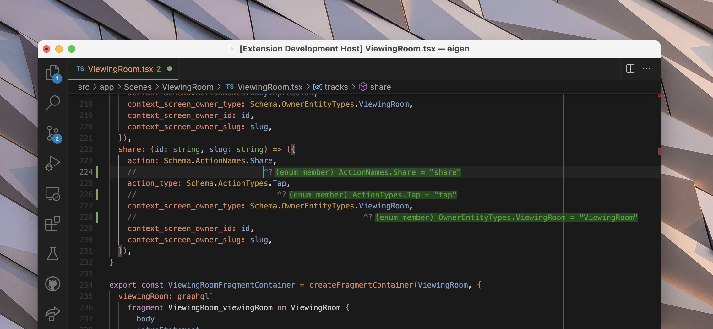

# vscode-twoslash-queries Read Me(JP)

VS Codeのための小さな(75LOC)拡張機能で、エディタ内でv// ^?` を使ってタイプをインラインでハイライトすることができる。既存のTypeScriptツールのインフラを`*.ts`、`*.tsx`、`*.js`、`*.jsx`ファイルに再利用し、インライン情報を追加するだけである。

キーボード戦士や、複雑な型に取り組んでいて、変更が他の型にどのように反映されるかを確認したい場合に便利です。

**VS Code の設定で、インレイ ヒントが有効になっていることを確認してください。**

## Features

ソースファイルのどこにでも `// ^?` を書くことができます (空白は前でも間でも真ん中でもかまいません)。

ここで、何度か使っているところをご覧ください。

